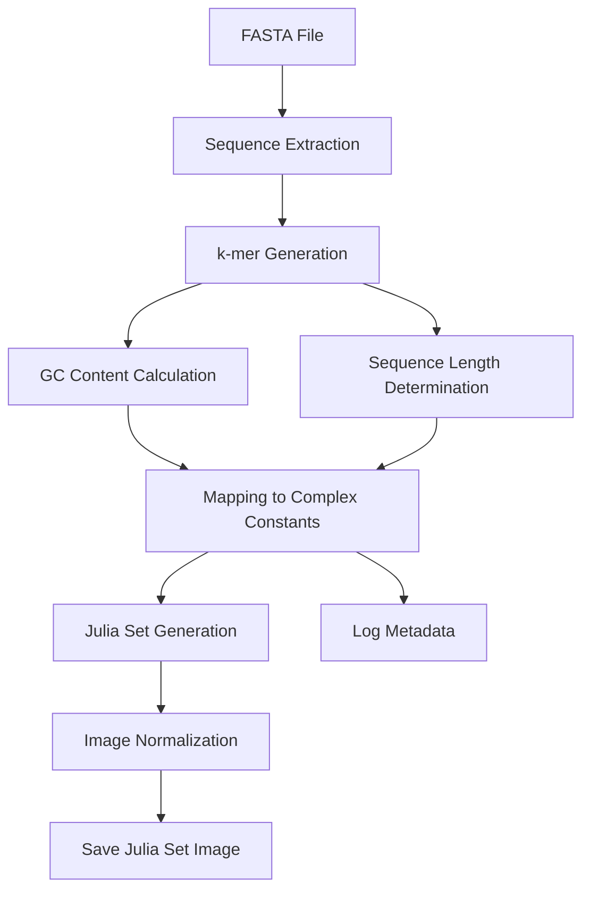

# BioJulia


Julia Set Generator from FASTA Sequences

## INTRODUCTION

### Julia Sets

A Julia set is a complex fractal pattern generated using complex numbers and iterative mathematical processes.

#### Key Concepts:

*Complex Number*

A number of the form ```z = a + bi```, where:
- ```a``` is the real part.
- ```b``` is the imaginary part.
- ```i``` is the imaginary unit, satisfying i<sup>2</sup> = -1

*Iteration*

Starting with a complex number z<sub>0</sub>, we apply the function z<sub>n+1</sub> = z<sub>n</sub><sup>2</sup> + c, 
where ```c``` is a constant complex number. This process is repeated multiple times to determine whether the sequence 
remains bounded or escapes to infinity.

*Fractal Boundary*

The Julia set consists of all points ```c``` in the complex plane where the iteration remains bounded, creating a boundary 
with infinite complexity.


#### Visual Representation


*Julia set for f<sub>c</sub>, c = −0.70176 − 0.3842i*

By [Simpsons contributor](https://en.wikipedia.org/wiki/User:Simpsons_contributor)  [Link](https://commons.wikimedia.org/w/index.php?curid=109638427)


*Julia set for representation for gene NM_000903.3 [Homo sapiens NAD(P)H quinone dehydrogenase 1 (NQO1]*

### Rationale

#### Visual Encoding:

Julia sets transform sequences into images, allowing the use of image-based deep learning models.

#### Capturing Complexity:

The iterative nature of Julia sets can encapsulate complex relationships within the sequence data.

#### Unique Representations:

Different sequences produce distinct Julia sets, preserving the uniqueness of each gene or genetic variant.

## Overview

The **Julia Set Generator from FASTA Sequences** is a Python-based tool designed to visualize nucleotide sequences as Julia sets. By mapping biological sequences to complex numbers, this tool generates intricate fractal images and animations, facilitating novel approaches in data visualization and deep learning applications.

### Methodology

The Julia Set Generator transforms biological sequences from FASTA files into unique fractal images known as Julia sets. This transformation uses the complexity of Julia sets to encode the biological and sequence characteristics of each input sequence. The process involves several key steps:

1. **Sequence Input and Preprocessing:**
   - **FASTA File Parsing:** The tool reads and extracts sequences from a provided FASTA file.
   - **k-mer Generation:** Non-overlapping k-mers (substrings of length k) are generated from each sequence to capture localized sequence patterns.
   - **GC Content Calculation:** The proportion of guanine (G) and cytosine (C) nucleotides in each sequence is computed, providing insight into the sequence's stability and structural properties.
   - **Sequence Length Determination:** The total length of each sequence is recorded to factor in its scale and complexity.

2. **Mapping Sequences to Complex Constants:**
   - **k-mer to Complex Mapping:** Each k-mer is mapped to a complex number based on purine/pyrimidine classification, where purines (A, G) and pyrimidines (C, T) influence the real and imaginary parts of the complex number.
   - **Incorporating GC Content and Sequence Length:** The calculated GC content and sequence length are integrated into the complex constant generation process, ensuring that these biological features influence the resulting Julia set's characteristics.
   - **Normalization and Validation:** The complex constants are scaled and validated to ensure they reside within a magnitude range conducive to generating intricate Julia sets.

3. **Julia Set Generation:**
   - **Iterative Computation:** Using the complex constant \( c \), the Julia set is generated through iterative calculations to determine the boundedness of points in the complex plane.
   - **Image Normalization:** The resulting Julia set data is normalized for enhanced visualization, applying logarithmic scaling to highlight fractal boundaries.

4. **Output and Visualization:**
   - **Image Saving:** The generated Julia sets are saved as high-resolution PNG images in the specified output directory.
   - **Metadata Logging:** Detailed metadata, including sequence headers, GC content, sequence length, and complex constants, are logged for reference and potential deep learning applications.

### Workflow

The following diagram illustrates the workflow of the Julia Set Generator:



## Getting Started

Follow these instructions to set up and run the project on your local machine.

### Prerequisites

- **Python 3.8+**
- finish


### Installation

1. **Clone the Repository**

   ```bash
   git clone https://github.com/yourusername/julia_set_generator.git
   cd julia_set_generator


#### TO DO

Testing various methods to capture more information from the sequences
1) Positional Encoding
2) k-mer Frequencies
3) Utilize Hash Functions for Mapping
4) Incorporate Biological relevant features (motifs etc.)
